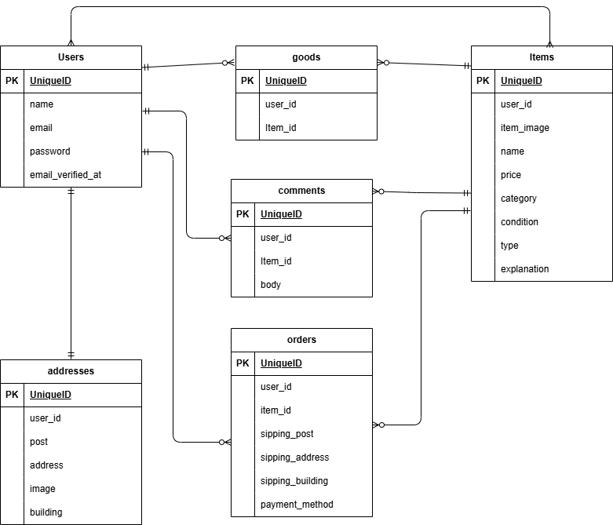

# mogitate(商品管理ページ)

## 環境構築
**Dockerビルド**
1. `git clone https://github.com/okazaki-ken/case1_FM.git`
2. DockerDesktopアプリを立ち上げる
3. `docker-compose up -d --build`

＊MySQLは、OSによって起動しない場合があるので、それぞれのPCに併せてdocker-compose.ymlファイルを編集してください。

**Laravel環境構築**
1. `docker-compose exec php bash`
2. `composer install`
3. 「.env.example」ファイルを 「.env」ファイルに命名を変更。または、新しく.envファイルを作成
4. .envに以下の環境変数を追加
``` 
DB_CONNECTION=mysql
DB_HOST=mysql
DB_PORT=3306
DB_DATABASE=laravel_db
DB_USERNAME=laravel_user
DB_PASSWORD=laravel_pass

MAIL_MAILER=smtp
MAIL_HOST=mailhog
MAIL_PORT=1025
MAIL_USERNAME=null
MAIL_PASSWORD=null
MAIL_ENCRYPTION=null
MAIL_FROM_ADDRESS="test@example.com"
MAIL_FROM_NAME="${APP_NAME}"
```
5. アプリケーションキーの作成
``` bash
php artisan key:generate
```

6. マイグレーションの実行
``` bash
php artisan migrate
```

7. シーディングの実行
``` bash
php artisan db:seed
```

8. 画像保存と公開設定
アプリでは商品画像やプロフィール画像を `storage/app/public` に保存しています。  
公開のためには以下のコマンドでシンボリックリンクを作成してください。
``` bash
php artisan storage:link
```

**開発用メール確認**
本アプリでは、会員登録時にメール認証を行います。
Docker コンテナで MailHog が既に設定されている場合、起動するだけで利用可能です。
 `docker-compose up -d mailhog`

Web UIにアクセスしてメールを確認
http://localhost:8025

Laravel は .env 設定に従って MailHog にメール送信します。
注意: 本番運用では MailHog は使用せず、SMTP サーバーを使用してください。

## 開発用ダミーログイン情報
※ 開発・確認用のため、本番環境では使用しないでください。
※ 管理者・一般ユーザーで表示内容や操作権限が異なります。

### ユーザーログイン
- URL：http://localhost/login

- 名前：ユーザー1
- Email：seller1@example.com
- Password：password

- 名前：ユーザー2
- Email：seller2@example.com
- Password：password

- 名前：ユーザー3
- Email：user@example.com
- Password：password

### ダミーデータ生成方法
Laravel環境構築手順の  
「6. マイグレーション実行」「7. シーディング実行」により  
ダミーデータが生成されます。

## Stripe設定
本アプリケーションでは、決済処理に [Stripe](https://stripe.com/jp) を使用しています。  
StripeのAPIキーは 各自のアカウントで取得 し、`.env` ファイルに設定してください。  
（本リポジトリにはセキュリティのため実際のキーは含まれていません）

**Stripe APIキーの取得**
  1. [Stripeダッシュボード（テストモード）](https://dashboard.stripe.com/test/apikeys) にログイン
  2. 「公開可能キー（Publishable key）」と「シークレットキー（Secret key）」をコピー

**`.env` ファイルへの設定**
以下の環境変数を `.env` に追加してください：
` ```env`
STRIPE_KEY=pk_test_xxxxxxxxxxxxx
STRIPE_SECRET=sk_test_xxxxxxxxxxxxx
※ pk_test_xxxxxxxxxxxxx / sk_test_xxxxxxxxxxxxx は Stripe ダッシュボードで取得したキーに置き換えてください。


## 使用技術(実行環境)
・PHP 8.2
・Larabel 10.x
・MySQL 8.0
・Blade / HTML / CSS
・JavaScript（Vanilla JS）
・MailHog（開発用メール確認）

## ER図


## URL
- 開発環境：http://localhost/
- phpMyAdmin:：http://localhost:8080/

##　他
- 仕様書にのっとり、ユーザー1とユーザー2は各5商品を出品しています。
- ユーザー3は出品を行いません。
- 仕様書とは異なりますが、取引完了時の評価にキャンセルボタンがございます。
